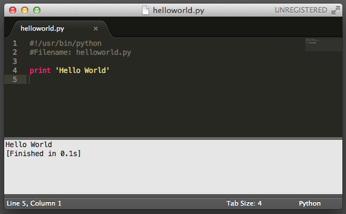

# First Steps

We will now see how to run a traditional 'Hello World' program in Python. This will teach you how to write, save and run Python programs.

There are two ways of using Python to run your program - using the interactive interpreter prompt or using a source file. We will now see how to use both of these methods.

## Using The Interpreter Prompt

Start the interpreter on the command line by entering `python` at the shell prompt.

For Windows users, you can run the interpreter in the command line if you have set the `PATH` variable appropriately.

In order to open the command line in Windows, open the start menu and click 'Run'. In the dialog box, type 'cmd' and press enter; you now have everything you need to get started with python in the DOS prompt.

Now enter `print('Hello World')` followed by the `enter` key. You should see the words `Hello World` as output.

~~~
$ python
Python 2.7.2 (default, Jun 20 2012, 16:23:33) 
[GCC 4.2.1 Compatible Apple Clang 4.0 (tags/Apple/clang-418.0.60)] on darwinType "help", "copyright", "credits" or "license" for more information.
>>> print 'Hello World'
Hello World
~~~

Notice that Python gives you the output of the line immediately! What you just entered is a single Python _statement_. We use `print` to (unsurprisingly) print any value that you supply to it. Here, we are supplying the text `Hello World` and this is promptly printed to the screen.

*How to Quit the Interpreter Prompt:* If you are using a Linux or Unix shell, you can exit the interpreter prompt by pressing `ctrl-d` or entering `exit()` (note: remember to include the parentheses, '()') followed by the `enter` key. If you are using the Windows command prompt, press `ctrl-z` followed by the `enter` key.

## Choosing An Editor

Before we move on to writing Python programs in source files, we need an editor to write the source files. The choice of an editor is crucial indeed. You have to choose an editor as you would choose a car you would buy. A good editor will help you write Python programs easily, making your journey more comfortable and helps you reach your destination (achieve your goal) in a much faster and safer way.

One of the very basic requirements is *syntax highlighting* where all the different parts of your Python program are colorized so that you can *see* your program and visualize its running.

If you are using Windows, then I suggest that you use IDLE. IDLE does syntax highlighting and a lot more such as allowing you to run your programs within IDLE among other things. A special note: **Do not use Notepad** - it is a bad choice because it does not do syntax highlighting and also importantly it does not support indentation of the text which is very important in our case as we will see later. Good editors such as [Sublime Text](http://www.sublimetext.com/) will automatically help you do this.

If you are using Linux, then you have a lot of choices for an editor. If you are just beginning to program, you might want to use [Sublime Text](http://www.sublimetext.com/).

If you are an experienced programmer, then you must be already using `Vim` or `Emacs`. Needless to say, these are two of the most powerful editors and you will benefit from using them to write your Python programs. I personally use `Vim` or `Emacs` for most of my programs. In case you are willing to take the time to learn Vim or Emacs, then I highly recommend that you do learn to use either of them as it will be very useful for you in the long run.

In this book, we will use [Sublime Text](http://www.sublimetext.com/) as our editor of choice.

I repeat once again, please choose a proper editor - it can make writing Python programs more fun and easy.

*For Vim users:* There is a good introduction on how to [make Vim a powerful Python IDE by John M Anderson](http://blog.sontek.net/blog/detail/turning-vim-into-a-modern-python-ide).

*For Emacs users:* There is a good introduction on how to [make Emacs a powerful Python IDE by Pedro Kroger](http://pedrokroger.net/2010/07/configuring-emacs-as-a-python-ide-2/).

## Using A Source File

Now let's get back to programming. There is a tradition that whenever you learn a new programming language, the first program that you write and run is the 'Hello World' program - all it does is just say 'Hello World' when you run it. As Simon Cozens (the author of the amazing 'Beginning Perl' book) puts it, it is the 'traditional incantation to the programming gods to help you learn the language better' :) .

Start your choice of editor, enter the following program and save it as `helloworld.py`

If you are using Sublime Text, type the below lines and do `File` --- `Save`, choose your home directory, give the name `helloworld.py` and click on `Tools` --- `Build` and you should see the output `Hello World` in a window that pops up.

~~~python
#!/usr/bin/python
Filename: helloworld.py

print 'Hello World'
~~~

You can also run this program by opening a shell (GNU/Linux terminal or DOS prompt) and entering the command `python helloworld.py`. (In Windows, you could also find the folder in which you saved the program, and then drag the actual file into the command line after you've typed `python`. This will automatically add the file path after the `python`.)

The output is as shown below.

~~~bash
$ python helloworld.py
Hello World
~~~

If you got the output as shown above, congratulations! - you have successfully run your first Python program.

In case you got an error, please type the above program *exactly* as shown above and run the program again. Note that Python is case-sensitive i.e. `print` is not the same as `Print` - note the lowercase `p` in the former and the uppercase `P` in the latter. Also, ensure there are no spaces or tabs before the first character in each line - we will see why this is important later.

A word of caution on the *shebang*. If you are a Windows user, you probably need to edit that to something like

`#!C:\Python32\python.exe`

and some Linux or Unix users may have to change it to something like

`#!/usr/local/bin/python` or
`#!/usr/bin/python`

The standard for Python is:

`#!/usr/bin/env python`

## How It Works

Let us consider the first two lines of the program. These are called *comments* - anything to the right of the `#` symbol is a comment and is mainly useful as notes for the reader of the program.

Python does not use comments except for the special case of the first line here. It is called the *shebang line* - whenever the first two characters of the source file are `#!` followed by the location of a program, this tells your GNU/Linux and Unix system that this program should be run with this interpreter when you *execute* the program. This is explained in detail in the next section. Note that you can always run the program on any platform by specifying the interpreter directly on the command line such as the command `python helloworld.py`.

*Important:* Use comments sensibly in your program to explain some important details of your program - this is useful for readers of your program so that they can easily understand what the program is doing. Remember, that person can be yourself after six months!

The comments are followed by a Python *statement*. Here we call the `print` *function* which just prints the text `'Hello World'`. We will learn about functions in a [later chapter](#functions), what you should understand now is that whatever you supply in the parentheses will be printed back to the screen. In this case, we supply `'Hello World'` which is referred to as a string - don't worry, we will explore these terminologies in detail later.

### Executable Python Programs

This applies only to Linux and Unix users but Windows users might be curious as well about the first line of the program. First, we have to give the program executable permission using the `chmod` command then *run* the source program.

~~~
$ chmod a+x helloworld.py
$ ./helloworld.py
Hello World
~~~

The chmod command is used here to *ch*ange the *mod*e of the file by giving e*x*ecute permission to *a*ll users of the system. Then, we execute the program directly by specifying the location of the source file. We use the `./` to indicate that the program is located in the current directory.

To make things more fun, you can rename the file to just `helloworld` and run it as `./helloworld` and it will still work since the system knows that it has to run the program using the interpreter whose location is specified in the first line in the source file.

What if you don't know where Python is located? Then, you can use the special `env` program on GNU/Linux or Unix systems. Just change the first line of the program to the following:

~~~python
#!/usr/bin/env python
~~~

The `env` program will in turn look for the Python interpreter which will run the program.

So far, we have been able to run our program as long as we know the exact path. What if we wanted to be able to run the program from anywhere? You can do this by storing the program in one of the directories listed in the `PATH` environment variable. Whenever you run any program, the system looks for that program in each of the directories listed in the `PATH` environment variable and then runs that program. We can make this program available everywhere by simply copying this source file to one of the directories listed in `PATH`.

~~~
$ echo $PATH
/usr/local/bin:/usr/bin:/bin:/usr/X11R6/bin:/home/swaroop/bin
$ cp helloworld.py /home/swaroop/bin/helloworld
$ helloworld
Hello World
~~~

We can display the `PATH` variable using the `echo` command and prefixing the variable name by `$` to indicate to the shell that we need the value of this variable. We see that `/home/swaroop/bin` is one of the directories in the PATH variable where *swaroop* is the username I am using in my system. There will usually be a similar directory for your username on your system. Alternatively, you can add a directory of your choice to the `PATH` variable - this can be done by running `PATH=$PATH:/home/swaroop/mydir` where `'/home/swaroop/mydir'` is the directory I want to add to the `PATH` variable.

This method is very useful if you want to write scripts you can run anytime, anywhere. It is like creating your own commands just like `cd` or any other commands that you use in the GNU/Linux terminal or DOS prompt.

*Caution:* With regard to Python, a program, script or software all mean the same thing.

## Getting Help

If you need quick information about any function or statement in Python, then you can use the built-in `help` functionality. This is very useful especially when using the interpreter prompt. For example, run `help(print)` - this displays the help for the print function which is used to print things to the screen.

*Note:* Press `q` to exit the help.

Similarly, you can obtain information about almost anything in Python. Use `help()` to learn more about using `help` itself!

In case you need to get help for operators like `return`, then you need to put those inside quotes such as `help('return')` so that Python doesn't get confused on what we're trying to do.

## Summary

You should now be able to write, save and run Python programs at ease. Now that you are a Python user, let's learn some more Python concepts.
