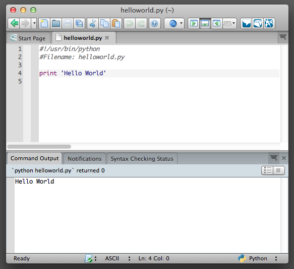

# First Steps

We will now see how to run a traditional 'Hello World' program in Python. This will teach you how to write, save and run Python programs.

There are two ways of using Python to run your program - using the interactive interpreter prompt or using a source file. We will now see how to use both of these methods.

## Using The Interpreter Prompt

Open the terminal in your operating system (as discussed previously in the [Installation chapter](#installation)) and then open the Python prompt by typing `python3` and pressing enter key.

Once you have started `python3`, you should see `>>>` where you can start typing stuff. This is called the *Python interpreter prompt*.

At the Python interpreter prompt, type `print('Hello World')` followed by the `enter` key. You should see the words `Hello World` as output.

Here is an example of what you should be seeing, when using a Mac OS X computer. The details about the Python software will differ based on your computer, but the part from the prompt (i.e. from `>>>` onwards) should be the same regardless of the operating system.

~~~
$ python3
Python 3.3.0 (default, Oct 22 2012, 12:20:36)
[GCC 4.2.1 Compatible Apple Clang 4.0 ((tags/Apple/clang-421.0.60))] on darwin
Type "help", "copyright", "credits" or "license" for more information.
>>> print('hello world')
hello world
>>> 
~~~

Notice that Python gives you the output of the line immediately! What you just entered is a single Python *statement*. We use `print` to (unsurprisingly) print any value that you supply to it. Here, we are supplying the text `Hello World` and this is promptly printed to the screen.

How to Quit the Interpreter Prompt

:   If you are using a Linux or Unix shell, you can exit the interpreter prompt by pressing `ctrl-d` or entering `exit()` (note: remember to include the parentheses, '()') followed by the `enter` key. If you are using the Windows command prompt, press `ctrl-z` followed by the `enter` key.

## Choosing An Editor

We cannot type out our program at the interpreter prompt every time we want to run something, so we have to save them in files and can run our programs any number of times.

To create our Python source files, we need an editor software where you can type and save. A good programmer's editor will make your life easier in writing the source files. Hence, the choice of an editor is crucial indeed. You have to choose an editor as you would choose a car you would buy. A good editor will help you write Python programs easily, making your journey more comfortable and helps you reach your destination (achieve your goal) in a much faster and safer way.

One of the very basic requirements is *syntax highlighting* where all the different parts of your Python program are colorized so that you can *see* your program and visualize its running.

If you have no idea where to start, I would recommend using [Komodo Edit](http://www.activestate.com/komodo-edit/downloads) software which is available on Windows, Mac OS X and Linux.

If you are using Windows, **do not use Notepad** - it is a bad choice because it does not do syntax highlighting and also importantly it does not support indentation of the text which is very important in our case as we will see later. Good editors such as Komodo Edit will automatically do this.

If you are an experienced programmer, then you must be already using [Vim](http://www.vim.org/) or [Emacs](http://www.gnu.org/software/emacs/). Needless to say, these are two of the most powerful editors and you will benefit from using them to write your Python programs. I personally use both for most of my programs, and have even written an [entire book on Vim](http://www.swaroopch.com/notes/vim). In case you are willing to take the time to learn Vim or Emacs, then I highly recommend that you do learn to use either of them as it will be very useful for you in the long run. However, as I mentioned before, beginners can start with Komodo Edit and focus the learning on Python rather than the editor at this moment.

To reiterate, please choose a proper editor - it can make writing Python programs more fun and easy.

For Vim users

:   There is a good introduction on how to [make Vim a powerful Python IDE by John M Anderson](http://blog.sontek.net/blog/detail/turning-vim-into-a-modern-python-ide). Also recommended is the [jedi-vim plugin](https://github.com/davidhalter/jedi-vim) and my [own dotvim configuration](https://github.com/swaroopch/dotvim).

For Emacs users

:   There is a good introduction on how to [make Emacs a powerful Python IDE by Pedro Kroger](http://pedrokroger.net/2010/07/configuring-emacs-as-a-python-ide-2/). Also recommended is [BG's dotemacs configuration](https://github.com/ghoseb/dotemacs).

## Using A Source File

Now let's get back to programming. There is a tradition that whenever you learn a new programming language, the first program that you write and run is the 'Hello World' program - all it does is just say 'Hello World' when you run it. As Simon Cozens (the author of the amazing 'Beginning Perl' book) puts it, it is the "traditional incantation to the programming gods to help you learn the language better."

Start your choice of editor, enter the following program and save it as `hello.py`.

If you are using Komodo Edit, click on `File` --- `New` --- `New File`, type the lines:

~~~python
print('Hello World')
~~~

In Komodo Edit, do `File` --- `Save` to save to a file.

Where should you save the file? To any folder for which you know the location of the folder. If you don't understand what that means, create a new folder and use that location to save and run all your Python programs:

- `C:\\py` on Windows
- `/tmp/py` on Linux
- `/tmp/py` on Mac OS X

To create a folder, use the `mkdir` command in the terminal, for example, `mkdir /tmp/py`.

Important

:   Always ensure that you give it the file extension of `.py`, for example, `foo.py`.

In Komodo Edit, click on `Tools` --- `Run Command`, type `python3 hello.py` and click on `Run` and you should see the output printed like in the screenshot below.

The best way, though, is to type it in Komodo Edit but to use a terminal:

#. Open a terminal as explained in the [Installation chapter](#installation).
#. *C*hange *d*irectory where you saved the file, for example, `cd /tmp/py`
#. Run the program by entering the command `python3 hello.py`.

The output is as shown below.

~~~
$ python3 hello.py
Hello World
~~~

If you got the output as shown above, congratulations! - you have successfully run your first Python program. You have successfully crossed the hardest part of learning programming, which is, getting started with your first program!

In case you got an error, please type the above program *exactly* as shown above and run the program again. Note that Python is case-sensitive i.e. `print` is not the same as `Print` - note the lowercase `p` in the former and the uppercase `P` in the latter. Also, ensure there are no spaces or tabs before the first character in each line - we will [see why this is important later](#indentation).

**How It Works**

A Python program is composed of *statements*. In our first program, we have only one statement. In this statement, we call the `print` *function* which just prints the text `'Hello World'`. We will learn about functions in detail in a [later chapter](#functions) - what you should understand now is that whatever you supply in the parentheses will be printed back to the screen. In this case, we supply the text `'Hello World'`.

### Executable Python Programs

This applies only to Linux and Unix users but Windows users should know this as well.

Every time, you want to run a Python program, we have to explicitly call `python3 foo.py`, but why can't we run it just like any other program on our computer? We can achieve that by using something called the *hashbang* line.

Add the below line as the *first line* of your program:

~~~python
#!/usr/bin/env python3
~~~

So, your program should look like this now:

~~~python
#!/usr/bin/env python3
print('Hello World')
~~~

Second, we have to give the program executable permission using the `chmod` command then *run* the source program.

The chmod command is used here to *ch*ange the *mod*e of the file by giving e*x*ecute permission to *a*ll users of the system.

~~~
$ chmod a+x hello.py
~~~

Now, we can run our program directly because our operating system calls `/usr/bin/env` which in turn will find our Python 3 software and hence knows how to run our source file:

~~~
$ ./hello.py
Hello World
~~~

We use the `./` to indicate that the program is located in the current folder.

To make things more fun, you can rename the file to just `hello` and run it as `./hello` and it will still work since the system knows that it has to run the program using the interpreter whose location is specified in the first line in the source file.

So far, we have been able to run our program as long as we know the exact path. What if we wanted to be able to run the program from folder? You can do this by storing the program in one of the folders listed in the `PATH` environment variable.

Whenever you run any program, the system looks for that program in each of the folders listed in the `PATH` environment variable and then runs that program. We can make this program available everywhere by simply copying this source file to one of the directories listed in `PATH`.

~~~
$ echo $PATH
/usr/local/bin:/usr/bin:/bin:/usr/X11R6/bin:/home/swaroop/bin
$ cp hello.py /home/swaroop/bin/hello
$ hello
Hello World
~~~

We can display the `PATH` variable using the `echo` command and prefixing the variable name by `$` to indicate to the shell that we need the value of this "environment variable". We see that `/home/swaroop/bin` is one of the directories in the PATH variable where *swaroop* is the username I am using in my system. There will usually be a similar directory for your username on your system.

If you want to add a directory of your choice to the `PATH` variable - this can be done by running `export PATH=$PATH:/home/swaroop/mydir` where `'/home/swaroop/mydir'` is the directory I want to add to the `PATH` variable.

This method is very useful if you want to write commands you can run anytime, anywhere. It is like creating your own commands just like `cd` or any other commands that you use in the terminal.

## Getting Help

If you need quick information about any function or statement in Python, then you can use the built-in `help` functionality. This is very useful especially when using the interpreter prompt. For example, run `help(print)` - this displays the help for the print function which is used to print things to the screen.

Note

:   Press `q` to exit the help.

Similarly, you can obtain information about almost anything in Python. Use `help()` to learn more about using `help` itself!

In case you need to get help for operators like `return`, then you need to put those inside quotes such as `help('return')` so that Python doesn't get confused on what we're trying to do.

## Summary

You should now be able to write, save and run Python programs at ease.

Now that you are a Python user, let's learn some more Python concepts.
