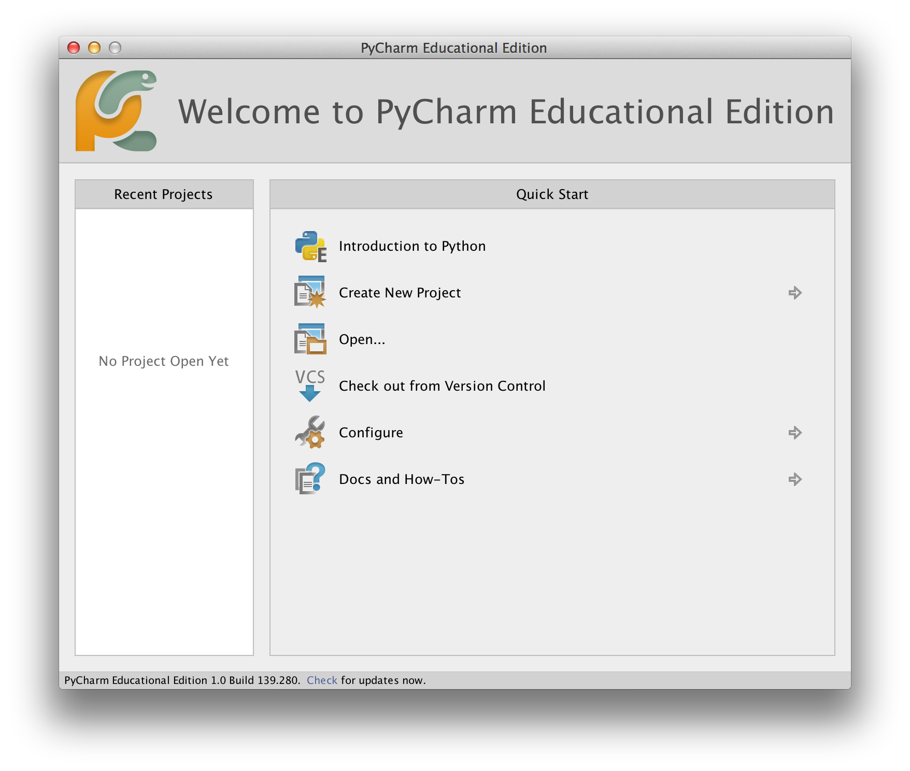
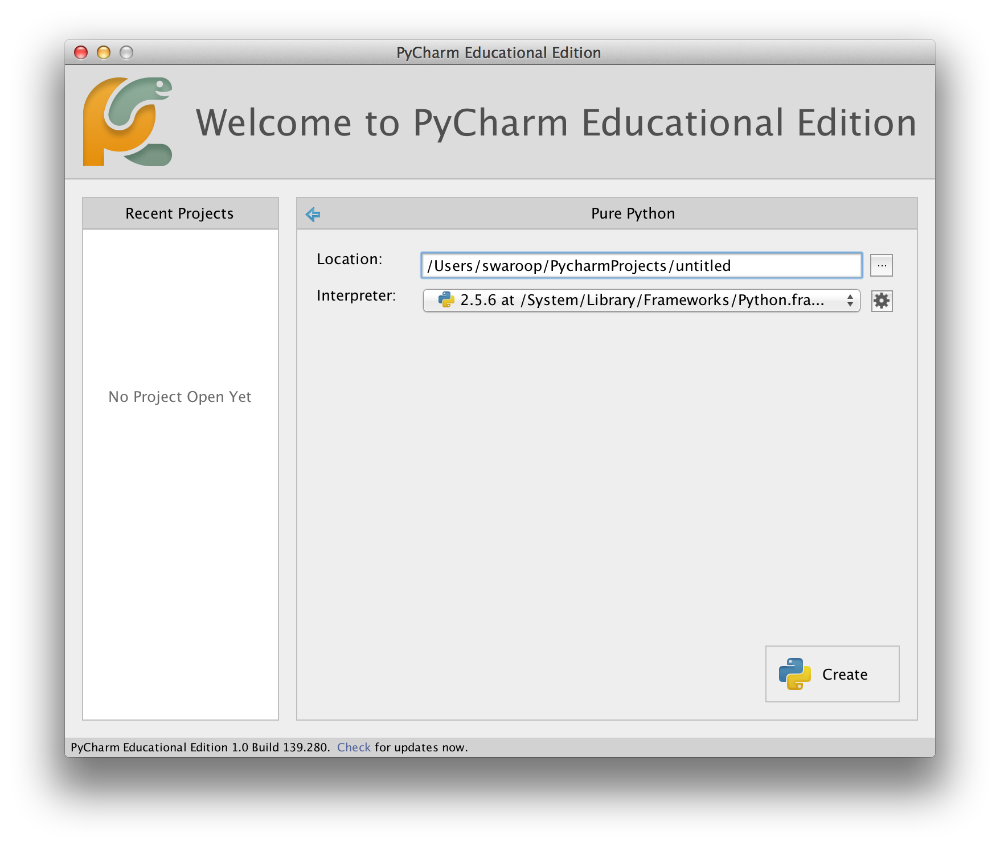
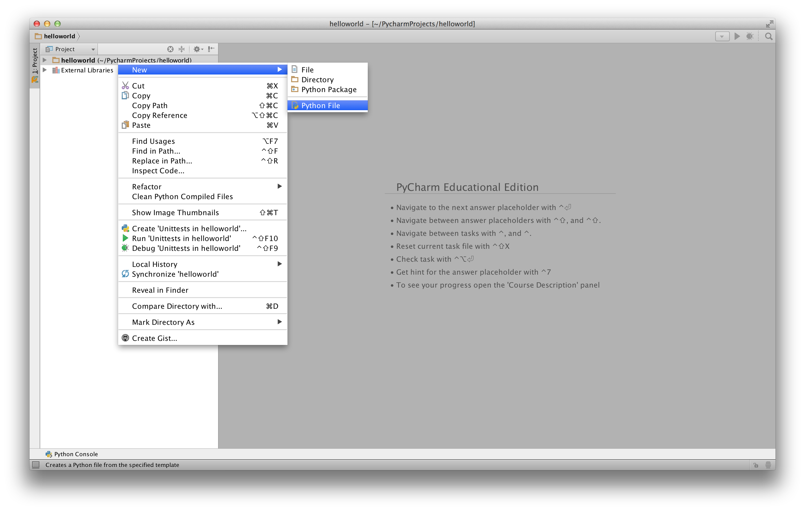
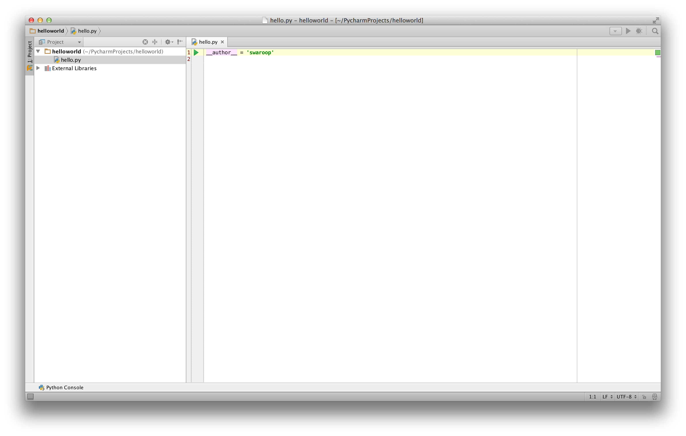
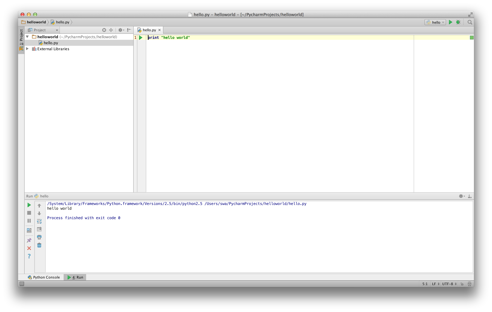

# 첫 걸음

이제 그 유명한 'Hello World' 프로그램을 파이썬으로 어떻게 실행하는지 배워보도록 하겠습니다. 이를 통해 파이썬 프로그램을 어떻게 작성하고, 저장하고, 실행하는지를 배우게 될 것입니다.

파이썬에서 프로그램을 실행하는 방법은 두 가지가 있습니다. 첫째는 대화형 인터프리터 프롬프트를 이용하는 방법과, 둘째는 소스 파일을 이용하는 것입니다. 지금부터 두 방법 모두 알아보도록 하겠습니다.

## 인터프리터 프롬프트를 활용하는 방법

여러분이 설치한 운영 체제에서 제공되는 터미널을 실행하세요(실행하는 방법은 [설치](./installation.md#installation) 챕터를 참조하세요). 그리고 `python3` 이라 입력한 뒤 `[enter]` 키를 눌러 인터프리터 프롬프트를 엽니다.

파이썬 프롬프트가 시작되면 `>>>` 이라는 문자열이 보이는데 이것은 여러분이 원하는 파이썬 명령을 입력할 수 있는 상태임을 뜻합니다. 이것을 우리는 _파이썬 인터프리터 프롬프트_ 라 부릅니다.

파이썬 인터프리터 프롬프트에서 다음을 입력하세요:

```python
print("Hello World")
```

`[enter]` 키를 입력하면, `Hello World` 라는 문자열이 화면상에 출력됨을 확인하실 수 있을 것입니다.

다음은 여러분이 Mac OS X 컴퓨터를 이용하고 있을 경우 볼 수 있을 것으로 예상되는 예제 화면입니다. 화면에 보이는 파이썬 프로그램에 대한 세부 사항은 컴퓨터에 따라 조금씩 다를 수 있습니다만, 프롬프트로부터 보이는 부분 (`>>>` 이후로 보이는 부분)은 여러분이 어떤 운영 체제를 이용하든지 동일할 것입니다.

<!-- The output should match pythonVersion variable in book.json -->
```python
$ python3
Python 3.6.0 (default, Jan 12 2017, 11:26:36)
[GCC 4.2.1 Compatible Apple LLVM 8.0.0 (clang-800.0.38)] on darwin
Type "help", "copyright", "credits" or "license" for more information.
>>> print("Hello World")
Hello World
```

파이썬은 여러분이 입력한 것에 대한 결과물을 바로바로 출력해준다는 점을 확인하세요! 방금 여러분이 입력한 것은 하나의 파이썬 _구문_ 입니다. 우리는 방금 `print` 를 이용하여 여기에 넘겨준 값을 출력하도록 한 것입니다 (별로 놀랍지는 않지만요). 다시 말하면 `Hello world` 라는 문자열을 넘겨 주었고, 이 결과가 곧바로 화면에 출력된 것입니다.

### 인터프리터 프롬프트를 종료하는 방법

여러분이 현재 GNU/Linux 혹은 Unix 쉘을 이용하는 중이라면, `[ctrl + d]` 를 누르거나 `exit()` 를 입력하여 프롬프트를 종료할 수 있습니다 (주의: exit 뒤에 괄호 `()` 를 붙인다는 점을 잊지 마세요).

만약 여러분이 윈도우 명령 프롬프트를 이용하는 중이라면, `[ctrl + z]` 키를 누르고 `[enter]` 키를 입력하여 프롬프트를 종료할 수 있습니다.

## 편집기 선택하기

여러분이 파이썬 프로그램을 실행할 때마다 매번 인터프리터 프롬프트를 실행하고 프로그램을 입력할 수는 없는 노릇입니다. 프로그램을 미리 파일로 저장해 두면, 언제든지 실행만 하면 되니 더 편리하겠죠.

파이썬 소스 코드 파일을 만들기 위해서는, 우선 글자를 입력할 수 있고 저장할 수 있는 편집기 프로그램이 필요합니다. 좋은 프로그래머들이 사용하는 편집기에는 소스 파일을 쉽게 작성할 수 있도록 돕는 여러 기능이 갖추어져 있습니다. 따라서 좋은 편집기를 고르는 것은 정말로 중요한 일입니다. 편집기를 고르는 것은 마치 여러분이 어떤 자동차를 구입할지 고르는 과정과도 같습니다. 좋은 편집기는 파이썬 프로그램을 쉽게 작성할 수 있도록 도와 주고, 여러분이 앞으로 떠날 여정을 좀 더 편리하게, 원하는 목적지에 닿을 때까지 (목표를 달성할 때까지) 더 빠르고 안전한 길로 안내할 것입니다.

가장 기초적인 필수 기능은 _문법 강조_ 기능입니다. 이 기능은 여러분이 작성한 파이썬 프로그램의 각 부분을 여러가지 다른 색깔로 표시해주어 여러분이 프로그램을 쉽게 _파악_하고 어떻게 실행되는지 알 수 있도록 돕습니다.

만약 어떤 편집기를 선택할 지 잘 모르겠으면, 저는 [PyCharm Educational Edition](https://www.jetbrains.com/pycharm-edu/) 을 이용할 것을 추천합니다. 이 소프트웨어는 윈도우, Mac OS X, GNU/Linux에서 모두 사용이 가능합니다. 더 자세한 사항은 다음 섹션에서 다루겠습니다.

혹시 여러분이 윈도우 사용자라면, *절대로 메모장을 사용하지 마세요*. 메모장은 문법 강조 기능을 지원하지 않을 뿐 아니라, 앞으로 중요하게 다루어지게 될 자동 들여쓰기 기능을 지원하지 않기 때문에 매우 안 좋은 선택이라 할 수 있습니다. 이런 기능들을 지원하는 소프트웨어를 사용해 주세요.

여러분이 숙련된 프로그래머라면 아마도 여러분은 [Vim](http://www.vim.org) 또는 [Emacs](http://www.gnu.org/software/emacs/) 에 이미 익숙할 것입니다. 말할 필요도 없이, 이 두 편집기는 현존하는 최고의 편집기들이며 파이썬 프로그램을 작성하는데에도 여러 장점이 있습니다. 저도 프로그램을 작성할 때 이 두 프로그램을 주로 사용하며, 심지어 [책 한 권을 Vim으로 작성하기도 했습니다]({{ book.vimBookUrl }}).

혹시 여러분이 Vim 또는 Emacs를 시간을 들여 배우고 싶으신 경우, 저는 둘 중 하나라도 그 사용법을 익혀 두기를 추천하며, 이것은 장기간에 걸쳐 큰 도움이 될 것입니다. 그러나, 초보자분들의 경우 지금 시점에서는 위에서 언급한 PyCharm 을 사용하시고, 편집기 사용법을 익히는데 시간을 투자하기 보다는 파이썬을 배우는데 초점을 맞추시는 편이 더 나을 수도 있을 것입니다.

다시 한번 말씀드리지만, 제대로 된 편집기를 이용하시기 바랍니다. 그러면 파이썬 프로그램을 작성하는 것이 더 재미있고 쉽게 느껴질 것입니다.

혹시 이 주제에 좀 더 관심이 있으시다면, 다음을 읽어 보세요: [Finding the Perfect Python Code Editor](https://realpython.com/courses/finding-perfect-python-code-editor/)

## PyCharm {#pycharm}

[PyCharm Educational Edition](https://www.jetbrains.com/pycharm-edu/) 은 여러분이 파이썬으로 프로그램을 작성할 때 사용할 수 있는 무료 편집기입니다.

PyCharm을 처음 실행하면 아래와 같은 화면을 보게 될 것입니다. `Create New Project` 를 누르세요:



다음으로 `Pure Python` 을 선택합니다:


이제 프로젝트 경로의 `untitled` 를 `helloworld` 로 변경해 주면 다음과 같은 화면을 볼 수 있을 것입니다:



`Create` 버튼을 누릅니다.

다음으로 사이드바에 있는 `helloworld` 를 오른쪽 버튼으로 클릭하고, 메뉴에서 `New` -> `Python File` 을 선택합니다:



그러면 파일명을 무엇으로 할 것인지 지정하는 창이 나타납니다. 여기서는 `hello` 라고 입력해 줍니다:


다음과 같이 새 파일이 생성되고 화면에 나타납니다:



이제 자동으로 미리 입력되어 있는 것들을 모두 삭제한 뒤, 다음을 입력합니다:

<!-- TODO: Update screenshots for Python 3 -->

```python
print("hello world")
```
입력이 끝났으면 소스 코드 창에서 오른쪽 버튼을 클릭하고, `Run 'hello'` 버튼을 누릅니다:


그러면 다음과 같이, 여러분이 방금 작성한 프로그램이 출력한 내용을 확인할 수 있을 것입니다:



여기까지입니다! 지금은 처음이기 때문에 몇가지 초기 설정을 더 해 주었지만, 다음부터는 왼쪽 사이드바에서 `helloworld` 를 오른쪽 클릭 -> `New` -> `Python File` 을 선택한 후 위와 동일한 방법을 따라서 새 프로그램을 입력한 후 실행하면 됩니다.

PyCharm에 대해 더 자세히 알고 싶으시다면, [PyCharm Quickstart 페이지 (영문)](https://www.jetbrains.com/pycharm-educational/quickstart/) 를 참조하세요.

## Vim

1. [Vim](http://www.vim.org) 설치
    * Mac OS X 사용자들은 [HomeBrew](http://brew.sh/) 를 통해 `macvim` 패키지를 설치하세요.
    *Windows 사용자들은 [Vim website](http://www.vim.org/download.php) 에서 "self-installing executable"을 내려받아 설치하세요.
    * GNU/Linux 사용자들은 각 배포판의 소프트웨어 저장소에서 Vim을 내려받아 설치하여야 합니다. 예를 들어 데비안 혹은 우분투의 경우 `vim` 패키지를 설치하세요.
2. 자동완성 기능을 위해 [jedi-vim](https://github.com/davidhalter/jedi-vim) 플러그인을 설치하세요.
3. 파이썬에서도 `jedi` 패키지를 설치해 줘야 합니다: `pip install -U jedi`

## Emacs

1. [Emacs 24+](http://www.gnu.org/software/emacs/) 설치
    * Mac OS X 사용자들은 http://emacsformacosx.com 에서 Emacs를 내려받아 설치하세요.
    * Windows 사용자들은 http://ftp.gnu.org/gnu/emacs/windows/ 에서 Emacs를 내려받아 설치하세요.
    * GNU/Linux 사용자들은 각 배포판의 소프트웨어 저장소에서 Emacs를 내려받아 설치하여야 합니다. 예를 들어 데비안 혹은 우분투의 경우 `emacs24` 패키지를 설치하세요.
2. [ELPY](https://github.com/jorgenschaefer/elpy/wiki) 를 설치하세요.

## 소스 파일을 활용하는 방법

이제 파이썬 프로그래밍으로 돌아갑시다. 아마 여러분이 어떤 언어를 배우던지, 'Hello World' 라는 프로그램을 처음 작성하고 실행하게 될 것입니다. 이 프로그램이 하는 일은 실행했을 때 단순히 'Hello World' 라는 문자열을 화면에 출력하는 것이 전부인데요, Simon Cozens[^1] 에 따르면 "Hello World 란 프로그래밍 신에게 이 언어를 잘 배울 수 있도록 도와 달라는, 일종의 주문 같은 것이다" 라 합니다.

여러분이 선택한 편집기를 실행하시고, 다음과 같이 프로그램을 작성한 뒤 `hello.py` 라는 이름으로 저장하세요.

만약 여러분이 PyCharm을 선택하셨다면, 앞에서 다룬 [PyCharm으로 파이썬 소스 파일을 저장하고 실행하는 방법](#pycharm) 을 참고하세요.

다른 에디터를 선택하셨다면, 새 파일을 열고 다음을 입력한 뒤 `hellp.py` 라는 이름으로 저장하세요:

```python
print("hello world")
```

파일을 어디에 저장해야 할까요? 아무 곳에나 저장해도 됩니다. 아무 곳이 어디에다 저장하라는 것인지
잘 모르겠는 경우에는 아래와 같이 새 폴더를 만들고, 우리가 앞으로 작성할 모든 파이썬 프로그램을
저장해 두도록 합시다:

- `/tmp/py` (Mac OS 환경)
- `/tmp/py` (GNU/Linux 환경)
- `C:\py` (Windows 환경)

폴더를 만드는 방법은 터미널에서 `mkdir` 명령을 이용하면 됩니다. 예를 들어 Max OS X 혹은 GNU/Linux의 경우 `mkdir /tmp/py` 라고 입력하면 됩니다.

중요: 파일의 확장자명을 `.py`로  지정했는지 언제나 다시 한번 확인하세요. 예를 들어 `foo.py` 와 같은 형태가 되어야 합니다.

파이썬 프로그램 실행하기:

1. 터미널 창을 여세요 ([설치](./installation.md#installation) 챕터에서 터미널 창을 여는 법을 다루고 있습니다).
2. cd (**C**hange **d**irectory의 약어) 명령으로 파일을 저장한 경로로 이동합니다. 예를 들어 Max OS X 혹은 GNU/Linux의 경우 `cd /tmp/py` 와 같이 입력하세요.
3. `python hello.py` 라 입력하여 프로그램을 실행합니다. 실행 결과는 아래와 같습니다.

```
$ python hello.py
hello world
```


위와 같은 결과물을 얻으셨나요? 축하합니다! 여러분은 여러분의 첫 파이썬 프로그램을 성공적으로 실행시킨 것입니다. 방금 여러분은 프로그래밍을 배울 때 접하는 가장 어려운 부분을 지나온 것입니다. 그것은 바로 첫 프로그램을 성공적으로 실행시키는 것입니다!

만약 결과물 대신 오류 메시지가 출력되는 경우에는, 다시한번 프로그램을 _정확하게_ 적혀진 그대로 입력했는 지 확인한 뒤 프로그램을 다시 실행해 보세요. 파이썬은 대/소문자를 구분합니다. 예를 들면 `print` 는 `Print` 와 같지 않습니다. 전자의 `p` 는 소문자이고, 후자의 `P` 는 대문자임에 유의하세요. 또한, 모든 줄의 첫번째 문자 앞에 공백이나 탭이 입력되어 있지는 않은지 확인하세요. 곧 [왜 이것이 중요한지 다룰 것입니다](./basics.md#indentation).

**동작 원리**

파이썬 프로그램은 _구문_ 들로 구성됩니다. 여러분이 작성한 첫 프로그램에서는, 단 한 가지의 구문만이 사용되었습니다. 여기서는 `print` 라고 하는 _구문_ 을 불러 "Hello World"라는 문자열을 출력하도록 한 것입니다.

## 도움 받기

여러분이 파이썬이 제공하는 여러 함수나 명령들에 대한 정보를 얻고 싶으실 경우, 파이썬에 내장된 `help` 명령을 사용할 수 있습니다. 이 기능은 인터프리터 프롬프트를 이용할 때 특히 유용합니다. 예를 들면, `help('len')`라고 입력해 보세요. 그러면 항목의 개수를 세는 데 사용되는 `len` 함수에 대한 도움말이 화면에 표시됩니다.

TIP: `q` 를 눌러 도움말을 종료할 수 있습니다.

비슷한 방법으로, 파이썬 내에 있는 거의 모든 항목에 대한 정보를 얻을 수 있습니다. `help()` 를 이용하여 `help` 라는 명령 자체에 대한 설명도 확인해 보세요!

혹시 여러분이 `return` 과 같이 실행 가능한 명령에 대한 정보를 얻고 싶은 경우, 좌우에 따옴표를 붙여줄 필요가 있습니다. 즉, `help('return')` 과 같이 해 주어 우리가 무엇을 하려고 하는 것인지 명확하게 해 줍니다.

## 요약

이제 여러분은 쉽게 파이썬 프로그램을 작성하고, 저장하고, 실행할 수 있을 것입니다.

이제 여러분은 한 명의 파이썬 사용자입니다. 이제 파이썬의 다른 기능들에 대해서도 배워 봅시다.

---

[^1]: 'Beginning Perl' 책의 저자
